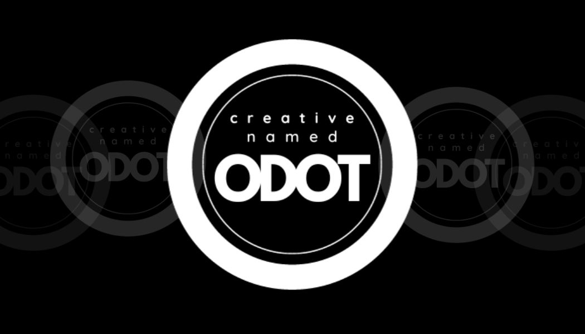

<!--Header -->

  

  

I am a full stack developer who enjoys creating innovative solutions.

- :telescope: I’m working on startup called: Robotic Insomnia Co while learning Linux.

- :seedling: Linux Systems Administration / Engineer is the goal I am currently working on.

- :zap: In my free time, I enjoy DIY projects, workouts and listening to great music.

<!-- Badges -->

  
  
  

<!-- Banner -->

<!--- :mailbox:How to reach me:  -->

<!---
CreativeNamedOdot/CreativeNamedOdot is a ✨ special ✨ repository because its `README.md` (this file) appears on your GitHub profile.
You can click the Preview link to take a look at your changes.
--->
